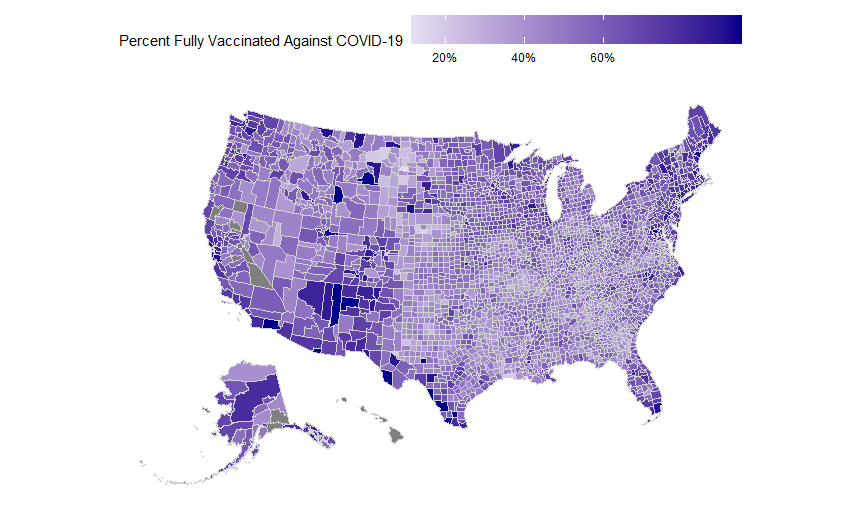

# U.S. County COVID-19 Vaccination Analysis

## Overview

This project analyzes county-level COVID-19 vaccination rates across the United States to explore how vaccination uptake varies with demographic, socioeconomic, health, and political characteristics. The goal is to identify broad patterns in vaccination rates and examine whether these relationships differ across political environments.

### Data Sources

Multiple publicly available datasets were merged at the county level using FIPS codes.

#### Sources include:

CDC county-level COVID-19 vaccination data

American Community Survey demographic and socioeconomic indicators

County health statistics

Rural–Urban Continuum Codes

County-level U.S. presidential election results

### Methods

Data from the above sources were merged into a master dataset using county FIPS identifiers. After cleaning and validating the data, a modeling dataset was constructed containing vaccination rates along with selected demographic, health, and political variables.

The analysis includes:

Simple linear regression examining vaccination rates and 2020 GOP vote share

Multiple regression models incorporating education and health variables

Variance Inflation Factor (VIF) diagnostics to assess multicollinearity

Stratified regression models comparing counties with ≥55% GOP vote share to those with lower Republican vote share

## Key Findings

Vaccination rates show a strong association with political and socioeconomic characteristics at the county level. While higher GOP vote share is associated with lower vaccination rates overall, other factors such as educational attainment, health coverage, and poverty also contribute to variation in vaccination uptake. Stratified models suggest that the predictors of vaccination rates differ between more Republican-leaning and more Democratic-leaning counties.

### Example Visualization



### Tools Used

R

tidyverse

ggplot2

usmaps

linear regression modeling

## Repository Structure
```
scripts/
  01_build_master_dataset.R
  02_modeling_and_analysis.R

outputs/
  figures/

report/
  vaccination_analysis_report.pdf
```
